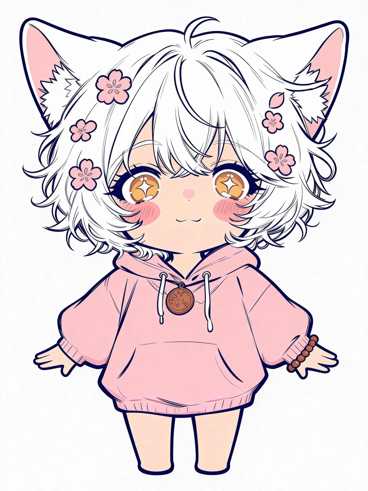
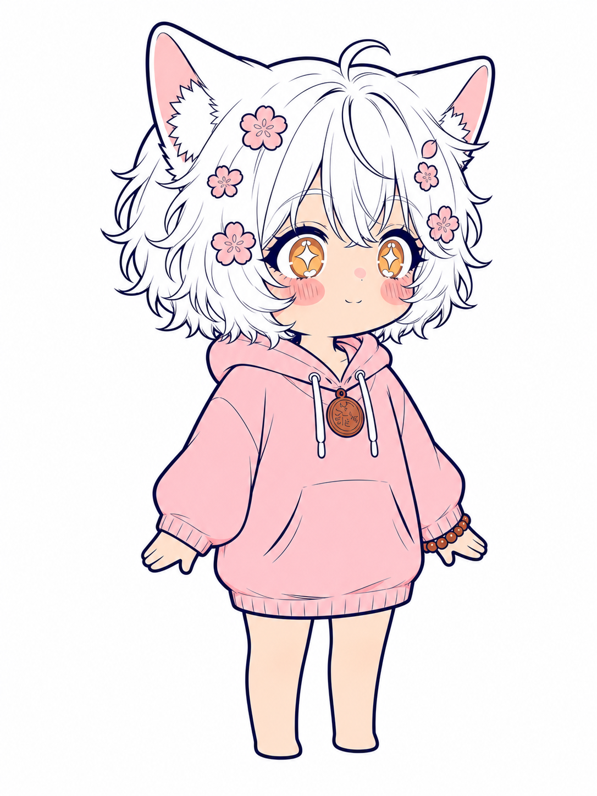
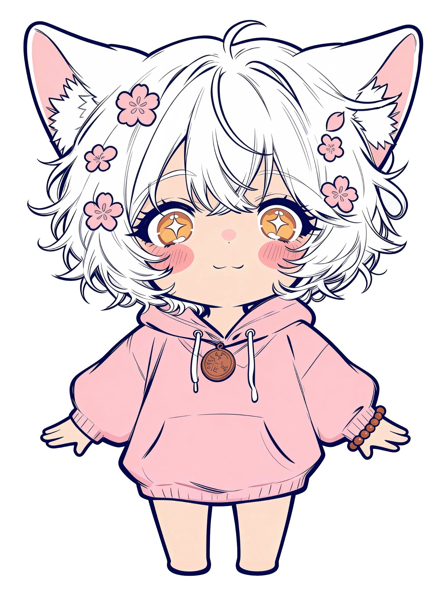
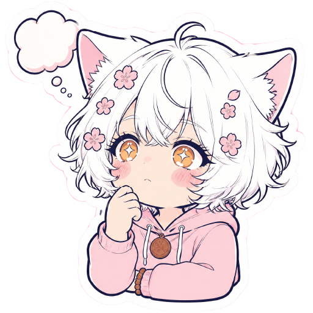

# DollarHua（花有财）— 共享 IP 形象资产

> 中文 · [English](./README.md)

本工作区的**可复用吉祥物 IP**。凡需要友好、统一品牌视觉面的地方都可以用它——
章节头图、提示框、社媒卡片、文章主视觉、状态横幅等。形象由仓库所有者设计，
本文件夹是该资产的**唯一权威来源**。请始终从这里取用（不要另存一份再引用），
以保证形象与配色一致。

- **素材包：** `DollarHua_AI_Character_Pack_Lite_v1.4`
- **版本：** Lite · v1.4 · **更新：** 2026-07-19
- **用途：** 面向低复杂度、低要求的灵活 AI 生成场景。

## 形象设定

| 项目 | 内容 |
|------|------|
| 英文名 | DollarHua |
| 中文名 | 花有财 |
| 昵称 | 花花 |
| 身份 | 热爱赚钱、藏有风水天赋的元气设计师。 |
| 性格 | ENFP — 元气、温暖、爱玩、有想象力、恢复力强。 |
| 口头禅 | 包能做的，但要加钱 |
| 外貌 | Q 版角色：蓬松短白发、巨大白色猫耳、温暖金色星眸、粉色花朵发饰、
  oversize 柔粉色连帽卫衣、铜钱吊坠、棕色串珠手链。 |

**可自由发挥**（按任务安全调整）：姿势、表情、场景、道具、服装细节、灯光、渲染风格。

## 配色标准

权威色板见 [`color_standard.json`](./color_standard.json)。
`signature_pink` 是**主识别色**，不可被取代。

| 标识 | 名称 | Hex | 用途 | 限制 |
|------|------|-----|------|------|
| `signature_pink` | 标志粉 | `#FEC6CD` | 卫衣、主柔粉区域、友好强调、主要品牌面。 | 勿偏移至饱和洋红或冷紫。 |
| `blossom_pink` | 花朵粉 | `#F3A6AF` | 花朵发饰、腮红、爱心、贴纸文字。 | 与标志粉同屏需保持足够对比。 |
| `amber_gold` | 琥珀金 | `#E3A04B` | 虹膜底色、星星、闪光、招财元素。 | 眼神高光保持白色；勿用绿/蓝眼。 |
| `outline_navy` | 描边藏青 | `#1D1E50` | 主线条稿、深色展示文字、贴纸描边。 | 核心线稿优先用此藏青而非纯黑。 |
| `pendant_bronze` | 吊坠古铜 | `#B86C40` | 圆吊坠、棕色串珠、克制的金属-大地色点缀。 | 勿将吊坠改为亮黄铜金。 |
| `warm_skin` | 暖肤色 | `#F9DECE` | 肤色基底、柔和暖调面部渲染。 | 保持柔和温暖；避免生硬灰阴影。 |
| `soft_white` | 柔白 | `#FCFDFD` | 头发、耳朵、干净背景、贴纸裁切线。 | 用微妙阴影保留白色体块；勿全平涂。 |
| `contextual_lucky_red` | 情境招财红 | `#E85D61` | 少量招财/警示/庆祝/风水点缀。 | 绝不可取代标志粉的主识别地位。 |

## 文件结构

```
dollarhua/
├── character.json        # 形象、外貌、可自由发挥规则
├── color_standard.json   # 8 个权威色 token
├── manifest.json         # 素材包元信息 + 各文件 SHA-256
├── prompt_seed.txt       # 生成基础提示词（从此起步）
├── references/           # 权威多角度参考
│   ├── front.png                 (5.8 MB)
│   ├── front_three_quarter.png
│   ├── front_transparent.png     (透明背景)
│   ├── left.png
│   ├── right.png
│   ├── back.png
│   └── rear_three_quarter.png
└── examples/             # 表情参考
    ├── hello.png
    ├── happy.png
    ├── crying.png
    └── thinking.png
```

### 参考图预览

| 正面 | 四分之三侧 | 透明底 |
|------|-----------|--------|
|  |  |  |

### 表情示例

| hello | happy | crying | thinking |
|-------|-------|--------|----------|
|  |  |  |  |

## 使用方式

1. **从提示词种子起步：** 复制 [`prompt_seed.txt`](./prompt_seed.txt) 作为基础提示词，
   再按任务调整姿势 / 表情 / 场景 / 道具 / 服装 / 灯光 / 风格（这些均被明确允许）。
2. **保持形象稳定：** 白发 + 猫耳、金色星眸、粉色花朵发饰、柔粉卫衣、铜钱吊坠、棕色串珠。
3. **遵守色板：** 使用上述 8 个 token；绝不可用其他色取代 `signature_pink` 的主色地位，
   也不可把吊坠改成亮黄铜金。
4. **参考图具有权威性：** 拿不准时以参考图为准。`front_transparent.png` 最适合做合成底图。
5. **唯一来源：** 从本文件夹链接或复制；勿在仓库其他地方引入一份 divergent 副本。

## 相关

- 上级文件夹：[../README-zh_CN.md](../README-zh_CN.md) · [English](../README.md)
- 工作区主页：[../../README-zh_CN.md](../../README-zh_CN.md) · [English](../../README.md)
